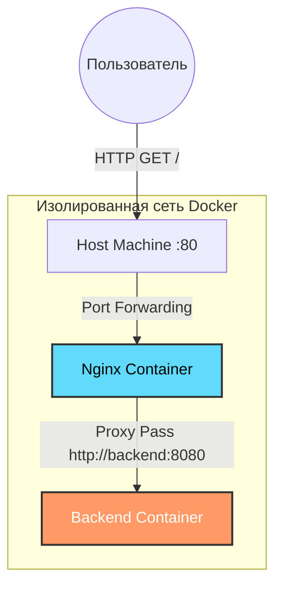

Простое веб-приложение (Python), доступное через обратный прокси (Nginx) в изолированной Docker-сети.

## 🛠 Технологии
* **Backend:** Python 3.11 (http.server), запуск от непривилегированного пользователя.
* **Proxy:** Nginx 1.25 (Alpine), кастомная конфигурация.
* **Infrastructure:** Docker, Docker Compose.

## 🚀 Как запустить

Убедитесь, что установлен **Docker** и **Docker Compose**.
В корне проекта выполните команду:

```bash
docker-compose up -d --build
```

## ✅ Как проверить результат

### 1. Проверка доступности
Откройте в браузере http://localhost или выполните команду в консоли:

```bash
curl http://localhost
```

**Ожидаемый ответ:**
```text
Hello from Effective Mobile!
```

### 2. Проверка изоляции
Бэкенд-сервис специально скрыт от внешнего доступа. Попытка прямого обращения к нему должна завершиться ошибкой:

```bash
curl http://localhost:8080
# Ожидается: Connection refused
```

## 🏗 Архитектура

Проект состоит из двух контейнеров, объединенных в сеть `app-network`.

1.  **Nginx (Frontend/Proxy):** Слушает порт `80` на хосте. Принимает запросы, добавляет заголовки (`X-Real-IP`, `Host`) и проксирует их на бэкенд по имени сервиса.
2.  **Backend:** Слушает порт `8080` внутри сети. Не имеет прямого доступа наружу (security best practice).

### Схема взаимодействия



## 📂 Структура проекта

```text
├── backend/
│   ├── Dockerfile   
│   └── app.py       
├── nginx/
│   ├── Dockerfile   
│   └── nginx.conf   
├── docker-compose.yml
└── README.md
```
